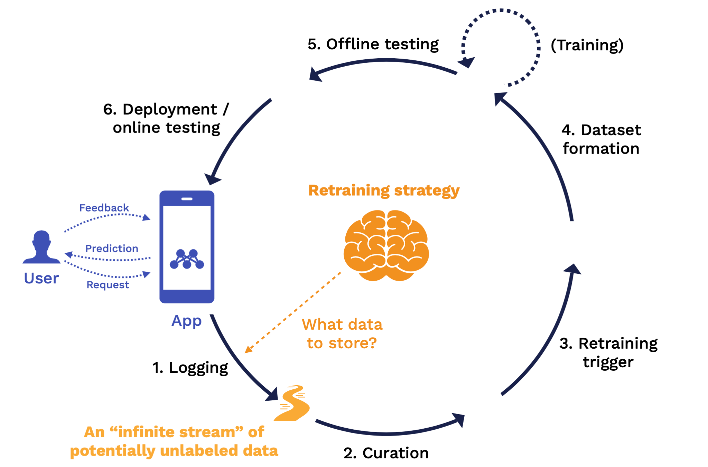

# DeepSparse Logging

DeepSparse Logging provides operational teams with access to the telemetry needed to monitor a deployment. 

For users seeking to put ML into production, these data are the raw materials that underpin the monitoring processes needed to create a system with consistently fresh and accurate predictions.

<p align="center">
     
</p>

There are many types of downstream monitoring tasks that ML teams may want to perform. Some are easier to do (such as looking at system performance) and some are harder (looking at model accuracy requires manually labeling some data afterwards). Examples include:
- **System performance:** what is the latency/throughput of a query?
- **Data quality:** is there an error in the model pipeline?
- **Data distribution shift:** are the inputs and outputs from the system expected?
- **Model accuracy:** what is the accuracy of the predictions vs human-labeled?

DeepSparse Logging is designed to provide maximum flexibility for users to extract whatever data is needed from a production inference pipeline into the logging system of their choice. 

## User Guide

### Metrics 
DeepSparse Logging provides access to two types of logging:
- **System Logging** give operations teams access to granual performance metrics, diagnosing and isolating deployment system health. Examples include CPU utilization and query latency.

- **Data Logging** gives ML teams access to inputs/outputs (and functions thereof) of each stage of an ML pipeline, supporting downsteam tasks like measuring accuracy and data drift. Examples include raw inputs and projections thereof such as mean pixel value.

### Logging Configuration
DeepSparse Logging is configured via YAML files. There are many pre-defined metrics and functions in addition to an extensible interface for adding custom metrics using Python.

> :warning: System Metric Logging is ***enabled*** by default and the YAML file is used to disable groups of system metrics

> :warning: Data Metric Logging is ***disabled*** by default and the YAML file is used to specify which data (or functions thereof) should be logged

<details>
    <summary><b>System Logging Configuration</b></summary>
    </br>

System Logging is *enabled* by default and all metrics are [pre-defined](/README.md#system-logging-metrics). Syetem Logging can be disabled 
globally or at the Group level by adding the key-value pairs with `on` or `off` status.

The following format is used:

```yaml
# system_logging: on/off            # [OPTIONAL] flag to turn all system logging on/off; note: if omitted, defaults to on

system_logging:
    deployment_details:     on/off  # [OPTIONAL] flag to turn off deployment details group; if omitted, defaults to on
    request_details:        on/off  # [OPTIONAL] flag to turn off request details group; if omitted, defaults to on
    prediction_latency:     on/off  # [OPTIONAL] flag to turn off prediction latency group; if omitted, defaults to on
    dynamic_batch_latency:  on/off  # [OPTIONAL] flag to turn off dynamic batch latency group; if omitted, defaults to on
    resource_utilization:   on/off  # [OPTIONAL] flag to turn off resource utilization group; if omitted, defaults to on     
```

A tangible example YAML snippit is below:

```yaml
# system_logging: off                << note: optional flag to turn off everything

system_logging:
    deployment_details: off
    request_details: off
    prediction_latency: on 
    dynamic_batch_latency: off
    # resource_utilization: on      << note: omitted groups are turned on by default
```
In this example, system logging is turned on globally. The Deployment Details, Request Details, and Dynamic Batch Latency groups are turned off while Prediction Latency and Resource Utilization groups are turned on.

</details>

<details>
    <summary><b>Data Logging Configuration</b></summary>
    </br>
        
Data Logging is *disabled* by default. A YAML configuration file is used to specify which data or functions thereof to log.

There are 4 `targets` in the inference pipeline where Data Logging can occur:

|Stage      |Pipeline Inputs      |Engine Inputs  |Engine Outputs     |Pipeline Outputs   |
|-----------|---------------------|---------------|-------------------|-------------------|
|Description|Inputs passed by user|Preprocessed tensors passed to model|Outputs from model (logits)|Postprocessed output returned to user|
|`target`   |`pipeline_inputs`    |`engine_inputs`|`engine_outputs`   |`pipeline_outputs` |
    
The following format is used to apply a list of [pre-defined](link) and/or [custom functions](link) to a Pipeline `target`:
 
```yaml     
pipeline_inputs:                    # options: pipeline_inputs, engine_inputs, engine_outputs, pipeline_outputs
  mapping:
    # first function
    - func: builtins/identity       # [REQUIRED STR] function identifier  (built-in or path to custom)
      frequency: 1000               # [OPTIONAL INT] logging frequency    (default: 1000 - logs once per 1000 predictions)
      target: all                   # [OPTIONAL STR] logger               (default: all)
    # second function
    - func: path/to/custom.py:my_fn  
      frequency: 10000
      target: prometheus
  
  # ... list of as many functions as desired
```

A tangible example YAML snippit is below:

```yaml
pipeline_inputs:
  mapping:
    - func: builtins/identity                   # pre-defined function (logs raw data)
      target: prometheus                        # only logs to prometheus
      frequency: 100                            # logs raw data once per 100 predictions
    - func: /path/to/logging_fns.py:my_fn       # custom function
      # frequency:                              # not specified, defaults to once per 1000 predictions
      # target:                                 # not specified, defaults to all loggers

engine_inputs:
  mapping:
    - func: builtins/channel-mean               # pre-defined function (logs per channel mean pixel)
      frequency: 10                             # logs channel-mean once per 10 predictions
      # target:                                 # not specified, defaults to all loggers

# engine_outputs:                             # not specified, so not logged
# pipeline_outputs:                           # not specified, so not logged
```
This configuration does the following at each stage of the Pipeline:
- **Pipeline Inputs**: Raw data (from the `identity` function) is logged to Prometheus once every 100 predictions and a custom function called `my_fn` is applied once every 1000 predictions and is logged to all loggers.
- **Engine Inputs**: The `channel-mean` function is applied once per 10 predictions and is logged to all loggers.
- **Engine Outputs**: No logging occurs at this stage
- **Pipeline Outputs**: No logging occurs at this stage

</details>

### Loggers
DeepSparse Logging provides users with ability to log to Prometheus out-of-the-box as well as the ability to add custom loggers.

[DAMIAN]

### Usage 

Both the `Server` and `Pipeline` interfaces can run with logging.

<details> 
    <summary><b>Server Usage</b></summary>
    </br>

The startup command (`deepsparse.server`), accepts an optional YAML configuration file (which contains both logging-specific and general configuration details) via the `--config` argument. For example:

```bash
deepsparse.server --config config.yaml
```

The logging is configured as described above. System Logging is defined globally at the `Server` level while Data Logging is defined at the `Endpoint` level. In the example below, we create a `Server` with two `Endpoints` (one with a dense BERT model and one with a sparse BERT model). We can see that System Logging is defined globally and Data Logging is defined per `Endpoint`.

```yaml
# config.yaml

num_cores: 16
num_workers: 8

loggers:
     -prometheus
     -custom_logger

system_logging:                                   # ** System Logging configured globally at Server level **
     deployment_details: off
     request_details: off
     prediction_latency: on 
     dynamic_batch_latency: off
     # resource_utilization:                      < not specified, so enabled by default

# system_logging: on                              < optional flag to turn off all system logging; OPTIONS: [ON/OFF]

endpoints:
     - task: question_answering
       route: /dense/predict
       model: zoo:nlp/question_answering/bert-base/pytorch/huggingface/squad/base-none
       batch_size: 1
       data_logging:                              # ** Data Logging configured at Endpoint level **
          - target: pipeline_inputs
               mappings:
                - func: builtins:sequence_length
                  frequency: 500
                  target: prometheus
                - func: path/to/custom/metrics.py:fn2
                  # frequency:                    < not specified, so logs at default rate of 1/1000 inferences
                  # target:                       < not specified, so logs to all
             - target: engine_inputs
                mappings:
                - func: buildins:identity
                  frequency: 1000
                  target: custom_logger
             # - target: engine_outputs           < not specified, so nothing logged at this target
             # - target: pipeline_outputs         < not specified, so nothing logged at this target
             
     - task: question_answering
       route: /sparse/predict
       model: zoo:nlp/question_answering/bert-base/pytorch/huggingface/squad/pruned95_obs_quant-none
       batch_size: 1
       # data_logging:                            < not specified, so no data logging for this endpoint
```

</details>

<details> 
    <summary><b>Pipeline Usage</b></summary>
    </br>

`ManagerLogger` is initialized with the `config` argument, which is a path to a local configuration file, and is passed as the `logger` argument to a `Pipeline`. 

For example, with the QA pipeline:

```python
from deepsparse import Pipeline

# SparseZoo model stub or path to ONNX file
model_path = "zoo:nlp/question_answering/bert-base/pytorch/huggingface/squad/12layer_pruned80_quant-none-vnni"

# logger object referencing the local logging config file
logger = ManagerLogger(config="logging-config.yaml")

# pipeline instantiated with the config file
pipeline = Pipeline.create(
    task="question-answering",
    model_path=model_path,
    config="config.yaml"
)

my_name = qa_pipeline(question="What's my name?", context="My name is Snorlax")
```
</details>
   


## System Logging Overview

DeepSparse provides System Logging to enable out-of-the-box monitoring of system performance and health. The following metric groups are enables by default:
- Deployment Details
- Request Details
- Prediction Latency
- Engine Batch Latency
- Resource Utilizaiton

See [below](/README.md#system-logging-metrics) for the detailed list.


### System Logging Metrics

|Group              |Metric           |Metric Name              |Description                              |Granularity    |Usage  |Frequency      |
|-------------------|---------------- |-------------------------|-----------------------------------------|---------------|-------|---------------|
|Deployment Details |Model Name       |`sl_dd_model_name`       |Name of the model running                |Per Pipeline   |All    |1 hour         |
|Deployment Details |CPU Arch         |`sl_dd_cpu_arch`         |Architecture of the CPU                  |Per Server     |All    |1 hour         |
|Deployment Details |CPU Model        |`sl_dd_cpu_model`        |Model of the CPU                         |Per Server     |All    |1 hour         |
|Deployment Details |Cores Used       |`sl_pl_num_cores`        |Number of cores used by the engine       |Per Server     |All    |1 hour         |
|Prediction Latency |Total Time       |`sl_pl_total_time`       |End-to-end prediction time               |Per Pipeline   |All    |Per Prediction |
|Prediction Latency |Preprocess Time  |`sl_pl_preprocess_time`  |Time spent in pre-processing step        |Per Pipeline   |All    |Per Prediction |
|Prediction Latency |Queue Time       |`sl_pl_queue_time`       |Time spent in queue (waiting for engine) |Per Pipeline   |All    |Per Prediction |
|Prediction Latency |Engine Time      |`sl_pl_engine_time`      |Time spent in engine forward pass        |Per Pipeline   |All    |Per Prediction |
|Prediction Latency |Postprocess Time |`sl_pl_postprocess_time` |Time spent in post-processing step       |Per Pipeline   |All    |Per Prediction |


