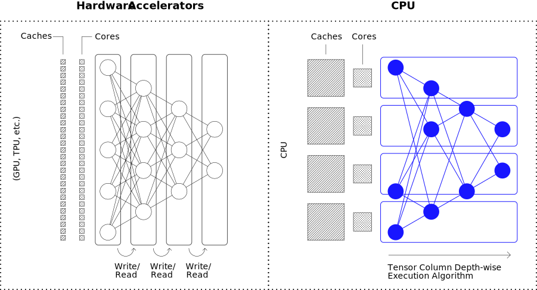

# Realtime Deployments on CPUs with DeepSparse

:books: Learn how to deploy YOLOv5 with **realtime latency on CPUs** utilizing Neural Magic's DeepSparse Engine:bangbang: 

:cinema: Checkout a demo of our DeepSparse running YOLOv5 in realtime on a 4 core laptop on [YouTube](https://www.youtube.com/watch?v=gGErxSqf05o).

UPDATED September 2022

DeepSparse is free for research, testing, and development but requires a commerical license for production use. We have a [60 day free trail](link_to_trial_page) running for the commerical version.

# DeepSparse Overview

DeepSparse is an inference runtime and server (similiar to NVIDIA's TensorRT+Triton) which runs **sparse** models with GPU-level performance on CPUs. By deploying perfomantly on CPUs, you can simplify deployment and reduce costs from cloud to edge.

>:rotating_light: **Clarification:** When we say sparse models, we are describing sparsity in the **weights** of the model. With proper pruning algorithms you can set ~75% of YOLOv5-l weights to 0 and retain 95% of the dense model's accuracy. See [Sparsifying YOLOv5](Ultralytics-Sparsify-README.md) for more details.

DeepSparse achieves realtime performance on CPUs through two main innovations:
- First, it implements sparse convolutions and matrix multiply operations, reducing the number of FLOPs by skipping the 0s. 
- Second, it uses the CPU’s large fast caches to provide locality of reference, executing the network depthwise and asynchronously.

<p align="center">
  
</p>

These two ideas enable DeepSparse to achieve suprising speedups and run inference in real-time on CPUs.

# DeepSparse Example

We will walk through an example using YOLOv5-l with DeepSparse, following these steps:
- Install DeepSparse
- Collect ONNX File
- Deploy a Model
- Benchmark Latency/Throughput

## :arrow_heading_down: Installation

Run the following. We reccomend you use a virtual enviornment.

```bash
pip install deepsparse[server]
```

> :warning: DeepSparse is tested on Python 3.6-3.9, ONNX 1.5.0-1.10.1, ONNX opset version 11+ and is manylinux compliant. It is limited to Linux systems running on X86 CPU architectures.

## :monocle_face: Collecting an ONNX File

DeepSparse accepts a model in the ONNX format. ONNX files can be generated through the export pathway for models trained/sparsified with Neural Magic's [SparseML](link_to_export_example) or using PyTorch/Keras native exporting functionality.

The `model_path` argument in the commands below tells DeepSparse where the ONNX file is. It can be one of two options:   
- `local_path` to `[model_name].onnx` in a local filesystem 
- `sparsezoo_stub` which identifies a pre-sparsified model in Neural Magic's [SparseZoo](https://sparsezoo.neuralmagic.com).

We will use the sparsified YOLOv5-l from the SparseZoo, which is identified by the following stub:
```
zoo:cv/detection/yolov5-l/pytorch/ultralytics/coco/pruned_quant-aggressive_95
```
## :rocket: Deploying a Model

The DeepSparse package contains two options for deployment: 
- **Python/C++ API:** run inference on the edge or within an application
- **HTTP Server:** create a model service utilizing REST APIs

Pull down a sample image for testing and save as `basilica.jpg` with the following command:
```bash
wget -O basilica.jpg https://raw.githubusercontent.com/neuralmagic/deepsparse/main/src/deepsparse/yolo/sample_images/basilica.jpg
```

#### :snake: Python/C++ API 

`Pipelines` wrap image pre-processing and output post-processing around the DeepSparse Engine. The DeepSparse-YOLOv5 integration includes an out-of-the-box `Pipeline` that accepts raw images and outputs the bounding boxes.

Create a `Pipeline` for inference with sparse YOLOv5-l using the following Python code:

```python
from deepsparse import Pipeline

# list of images in local filesystem
images = ["basilica.jpg"]

# create Pipeline containing DeepSparse
model_stub = "zoo:cv/detection/yolov5-l/pytorch/ultralytics/coco/pruned_quant-aggressive_95"
yolo_pipeline = Pipeline.create(
    task="yolo",            # do the YOLO pre-processing + post-processing
    model_path=model_stub,  # if using a local model, can pass the local path here
)

# run inference on images, recieve bounding boxes + classes
pipeline_outputs = yolo_pipeline(images=images, iou_thres=0.6, conf_thres=0.001)
```

#### :electric_plug: HTTP Server 

Alternatively, DeepSparse offers a server runs on top of the popular FastAPI web framework and Uvicorn web server such that you can query a model via HTTP. The server supports any task from DeepSparse, such as `Pipelines` for object detection tasks.

Spin up the server with sparse YOLOv5-l by running the following from the command line: 

```bash
deepsparse.server \
    task yolo \
    --model_path "zoo:cv/detection/yolov5-l/pytorch/ultralytics/coco/pruned_quant-aggressive_95"
```

An example request, using Python's `requests` package:
```python
import requests
import json

# list of images for inference (local files on client side)
path = ['basilica.jpg'] 
files = [('request', open(img, 'rb')) for img in path]

# send request over HTTP to /predict/from_files endpoint
url = 'http://0.0.0.0:5543/predict/from_files'
resp = requests.post(url=url, files=files)

# response is returned in JSON
annotations = json.loads(resp.text) # dictionary of annotation results
bounding_boxes = annotations["boxes"]
labels = annotations["labels"]
```

## :bar_chart: Benchmarking 

The mission of Neural Magic is to enable GPU-class inference performance on commodity CPUs. Want to find out how fast our sparse YOLOv5 ONNX models perform inference? You can quickly do benchmarking tests on your own with a single CLI command!

You only need to provide the model path of a SparseZoo ONNX model or your own local ONNX model to get started:

``` bash
deepsparse.benchmark \
    zoo:cv/detection/yolov5-l/pytorch/ultralytics/coco/pruned_quant-aggressive_95 \
    --scenario sync 

>> Original Model Path: zoo:cv/detection/yolov5-l/pytorch/ultralytics/coco/pruned_quant-aggressive_95
>> Batch Size: 1
>> Scenario: sync
>> Throughput (items/sec): 74.0355
>> Latency Mean (ms/batch): 13.4924
>> Latency Median (ms/batch): 13.4177
>> Latency Std (ms/batch): 0.2166
>> Iterations: 741

```
